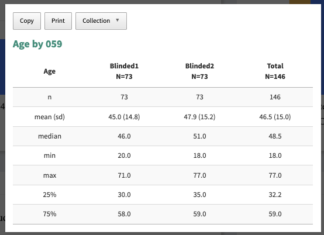

```{r setup, include=FALSE}

knitr::opts_chunk$set(echo = TRUE)
options(reactable.static = TRUE)
library(ggpubr)
library(ggplot2)
library(RColorBrewer) 
library(reactable)
library(reactablefmtr)
library(htmltools)
library(dplyr)
library(fontawesome)
library(DT)
library(klippy) # remotes::install_github("rlesur/klippy")
# renv::settings$snapshot.type("all")
# renv::snapshot()
library(arsenal)  #  install.packages("arsenal")
```

```{r klippy, echo=FALSE, include=TRUE}

# Add copy to clibboard
klippy::klippy(
  lang = c("r", "markdown"),
  all_precode = TRUE,
  position = c("top", "right"),
  color = "white",
  tooltip_message = "Click to copy",
  tooltip_success = "Copied!"
)

tf <- tempfile(fileext = c(".Rmd", ".html"))
writeLines(
  c("```{r klippy, echo=FALSE, include=TRUE}",
    "klippy::klippy()",
    "```",
    "Insert this chunk in your `Rmd` file:",
    "````markdown",
    "`r ''````{r klippy, echo=FALSE, include=TRUE}",
    "klippy::klippy()",
    "```",
    "````"
  ),
  tf[1]
)

if (FALSE) {
rmarkdown::render(tf[1], "html_document", tf[2])
browseURL(paste0("file://", tf[2]))}
```


```{r setup-footer, include=FALSE}
# https://stackoverflow.com/questions/71621136/rmarkdown-yaml-section-add-authors-hyperlink-email-to-footer
knitr::opts_chunk$set(echo = TRUE)

writeLines(
  sprintf(
    '&nbsp;
    <h5 style="text-align: center;color:#465362;"> Thank you for reading </h5>
    <hr style="height:2px;border-width:0;color:#184558;background-color:#184558">
    <div class="footer">
    <p style="text-align: center;">R Shiny with <a href="https://github.com/%s/">%s</a></p>
    <p style="text-align: center;"><span style="color: #808080;"><em><a href="mailto:%s">%s</a></em></span></p>
    <!-- Add icon library -->
    <link rel="stylesheet" href="https://maxcdn.bootstrapcdn.com/font-awesome/4.3.0/css/font-awesome.min.css">
    <!-- Add font awesome icons -->
    <p style="text-align: center;">
      <a href="https://twitter.com/%s?lang=en" class="fa fa-twitter"></a>
      <a href="https://www.linkedin.com/in/%s/" class="fa fa-linkedin"></a>
      <a href="https://github.com/%s/" class="fa fa-github"></a>
      <a href="https://youtube.com/@%s/" class="fa fa-youtube"></a>
    </p>
    </div>
    &nbsp;',
    params$github,
    params$author,
    params$email,
    params$email,
    params$twitter,
    params$linkedin,
    params$github,
    params$youtube
  ),
  'after.html'
)
```


```{css ref.label="styles", echo=FALSE}

```


```{css ref.label="pkgdown_styles", echo=FALSE}
```


```{css styles, eval=FALSE, include = FALSE}
#TOC {
  left: 100px;
  margin: 10px 0px 25px 0px;
  border-color: #184558;
}

.main-container {
    margin-left: 30px;
}

.list-group-item.active, .list-group-item.active:hover, .list-group-item.active:focus {
    z-index: 2;
    color: #ffffff;
    background-color: #9F2B68;
    border-color: #9F2B68;
}

.tocify-subheader > .tocify-item { text-indent: initial; padding-left:2em;}


/*https://www.w3.org/Style/Examples/007/fonts.en.html*/
.author {font-size: 15px;font-family: "American Typewriter", serif;color:#9F2B68;}
.title {font-family: "Apple Chancery", cursive; font-size: 35px;font-weight:bold;}
.date {font-family: "American Typewriter", serif; font-size: 20px;font-weight:bold;}
.subtitle {font-family: "American Typewriter", serif; font-size: 20px;font-weight:bold;}
h3 {font-family: "American Typewriter", serif; font-size: 20px;font-weight:bold;}
h4 {font-family: "American Typewriter", serif; font-size: 18px;font-weight:bold;}
h5 {font-family: "American Typewriter", serif; font-size: 18px;font-weight:bold; color:#9F2B68;}
p {font-family: "American Typewriter", serif;font-size: 14px;}


.header {
  border-bottom-color: #555;
  font-size: 1.5rem;
  font-weight: 700;
  /*text-transform: uppercase;*/
  color:#465362; 
}
/* Highlight headers when sorting */
.header:hover,
.header:focus,
.header[aria-sort="ascending"],
.header[aria-sort="descending"] {
  background-color: #eee;
}

.manufacturer {
  display: flex;
  align-items: center;
}
.manufacturer-logo {
  height: 2rem;
  width: 4rem;
  border: 1px solid #f0f0f0;
}
.manufacturer-name {
  margin-left: 1rem;
  font-size: 1.4rem;
  font-weight: 700;
  color:#465362; 
}
.manufacturer-origin {
  margin-left: 0.35rem;
  color: hsl(0, 0%, 45%);
  font-size: 1.125rem;
  font-weight: 700;
}

a {color:#9F2B68;font-weight:normal}

body, td {
   font-size: 14px;
}
code.r{
  font-size: 16px;
}
pre {
  font-size: 16px
}

```


```{css pkgdown_styles, include=FALSE}

/* pkgdown articles */
.row > main {
  max-width: 1800px;
}
.page-header {
  display: none;
}
/* rmarkdown html documents */
.main-container {
  max-width: 1600px !important;
  margin-left: 80px;
  margin-right: 80px;
  color:#184558;
  font-family: "American Typewriter", serif; 
  font-size: 15px;
}
```


## Read data


```{r echo=TRUE, eval=FALSE, warning=FALSE, message=FALSE}
# read all data in data folder
paths <- list.files("data")
dataset <- purrr::map(
  paths,
  ~read.csv(glue::glue("data/{.x}"))
)
names(dataset) <- gsub(".csv","", paths)
list2env(dataset, envir = globalenv())
#======================================
# Precossing data
adsl$study <- factor(ifelse(adsl$STUDYID == "STUDY-1", "National Study", "Non-National Study"), levels = c("National Study","Non-National Study"))
```


## Writing functions

I would like you read more about writing function from this book `R for Data Science` https://r4ds.had.co.nz/functions.html

### Listing

Table for continuous variables

<ul>

{width=40%}

1. How many columns are there? 

a. Output of Continuous Variable (1st Column)

b. Group Variable (2nd and 3rd Column)

c. Total Column (Sum of 2nd and 3rd Column)

2. How many rows are there? How many are decimal points? How is the format?

We need to show n, mean (sd), min, max, 25%, 75%

3. Think about which parameters to create this table?


```{r echo=TRUE, eval=FALSE, warning=FALSE, message=FALSE}
calc_numeric_statistics <- function(df, var, group) {
  var = ensym(var)
  group = ensym(group)
  df %>%
    group_by(!!group) %>%
    dplyr::summarise(
        n = dplyr::n(),
        mean = mean(!!var, na.rm = TRUE),
        sd = sd(!!var, na.rm = TRUE),
        min = min(!!var, na.rm = TRUE),
        max = max(!!var, na.rm = TRUE),
        median = median(!!var, na.rm = TRUE),
        p25 = quantile(!!var, 0.25, na.rm = TRUE),
        p75 = quantile(!!var, 0.75, na.rm = TRUE)) 

}

calc_numeric_statistics(adsl, CGISGR1N, ARM)

```


Table for categorical variables

1. How many columns are there? 

a. Levels of Categorical Variable (1st Column)

b. Group Variable (2nd and 3rd Column)

c. Total Column (Sum of 2nd and 3rd Column)

2. How many rows are there? How is the format?

We need to show the n (%) by each level

3. Think about which parameters to create this table?

<ul>

{width=40%}

```{r echo=TRUE, eval=FALSE, warning=FALSE, message=FALSE}

calc_catgorical_statistics <- function(df,var,group){
  vars <- ensym(var)
  groups <- ensym(group)
  dt <- df %>% count(!!groups, !!vars) %>% group_by(!!groups) %>% mutate(per = (n/ sum(n))*100)
  return(dt)
}

calc_catgorical_statistics(adsl, BMIGR1, ARM)
```


### Figures

### Prepare Data for Plot


```{r echo=TRUE, eval=FALSE, warning=FALSE, message=FALSE}
get_bar_dt <- function(df,var, ...){
  vars <- ensym(var)
  groups <- ensyms(...)
  dt <- df %>% count(!!!groups, !!vars) %>% group_by(!!!groups) %>% mutate(per = (n/ sum(n))*100)
  return(dt)
}


gender_dt <- get_bar_dt(adsl, SEX, study, ARM)
gender_dt <- get_bar_dt(adsl, "SEX", "study", "ARM")

dt <- gender_dt
dt$text <- paste0(dt$n, "\n(", sprintf('%.1f', dt$per), ")")
dt$text1 <- paste0(dt$n, " (", sprintf('%.1f', dt$per), "%)")
dt$key <- paste0(dt$study, "_", dt$SEX)
dt$key <- factor(dt$key, levels = c("National Study_F", "National Study_M" ,"Non-National Study_F" ,"Non-National Study_M"))
dt$hovertext <- paste(dt$study,"<br>", dt$ARM,"<br>", dt$SEX,"<br>", dt$text1)
```


### Plot Function


```{r echo=TRUE, eval=FALSE, warning=FALSE, message=FALSE}
bar_plot <- function(dt, x_var, y_var, color_var, title = "", ticktext,tickvals ){
  dt %>% plot_ly(  x = ~ get(x_var),
                   color = ~ get(color_var),
                   y = ~get(y_var),
                   legendgroup=~get(x_var),
                   text= ~text,
                   # customdata = ~study,
                   # source = "gender_out",
                   hoverinfo = "text",
                   hovertext = ~ hovertext,
                   textposition = 'outside',
                   textfont = list(size =11, color= "black"),
                   colors = c("#ffc04c", "#4c8bff"), #c("#80cdc1", "#01665e"),
                   opacity = 1,
                   height = 400) %>%
    layout(
      bargap = 0.4,
      annotations = list(
        list(
          text = "National Study",
          font = list(color = 'black',
                      family = 'sans serif',
                      size = 18),
          xref = "paper",
          yref = "paper",
          yanchor = "bottom",
          xanchor = "center",
          align = "center",
          x = 0.25,
          y = -0.25,
          showarrow = FALSE)
        ,list(
          text = "Non National Study",
          font = list(color = 'black',
                      family = 'sans serif',
                      size = 18),
          xref = "paper",
          yref = "paper",
          yanchor = "bottom",
          xanchor = "center",
          align = "center",
          x = 0.75,
          y = -0.25,
          showarrow = FALSE)
      ),boxmode = "group",
      font = list(color = 'gray',family = 'sans serif',size = 12),
      hoverlabel = list(font=list(size=13)),
      title = list(text = title,
                   font = list(
                     family = 'sans serif',
                     size = 20,
                     color = "black")),
      margin =list( l=10,r=10,b=70,t=80,pad=10),
      xaxis = list(
        tickfont = list(
          family = 'sans serif',
          size = 17,
          color = "black"
        ),
        titlefont = list(
          family = 'sans serif',
          size = 17,
          color = "black"
        ),
        title = "",
        zeroline = FALSE,
        ticktext = ticktext,
        tickvals = tickvals,
        tickmode = "array", 
        color = "black"
      ),
      yaxis = list(
        range = c(0, max(dt$n) +  (max(dt$n)/3) ),
        tickfont = list(
          family = 'sans serif',
          size = 17,
          color = "black"),
        titlefont = list(
          family = 'sans serif',
          size = 17,
          color = "black"),
        title = "",
        zeroline = FALSE,
        color = "black"),
      legend = list(orientation = "v",   # show entries horizontally
                    xanchor = "center",  # use center of legend as anchor
                    y = 1,
                    x = 0.85))
  
}

bar_plot(dt, x_var = "key", y_var = "n", color_var = "ARM", title = "Gender Bar Plot", ticktext = list("F","M","F","M"), 
         tickvals = list("National Study_F", "National Study_M" ,"Non-National Study_F" ,"Non-National Study_M") )


```


## R Shiny Application

It's a visualization dashboard in order to produce actionable insights. 

<ul>

{width=40%}

</ul>

### UI (Layout/FrontEnd the Application)


```{r echo=TRUE, eval=FALSE, warning=FALSE, message=FALSE}
# path <- "../data"
# ls_file <- list.files(path, pattern = ".csv")
# ls_file
```


### Server (Backend the application)

### www folder

### Source folder


## Publishing R Shiny Application


